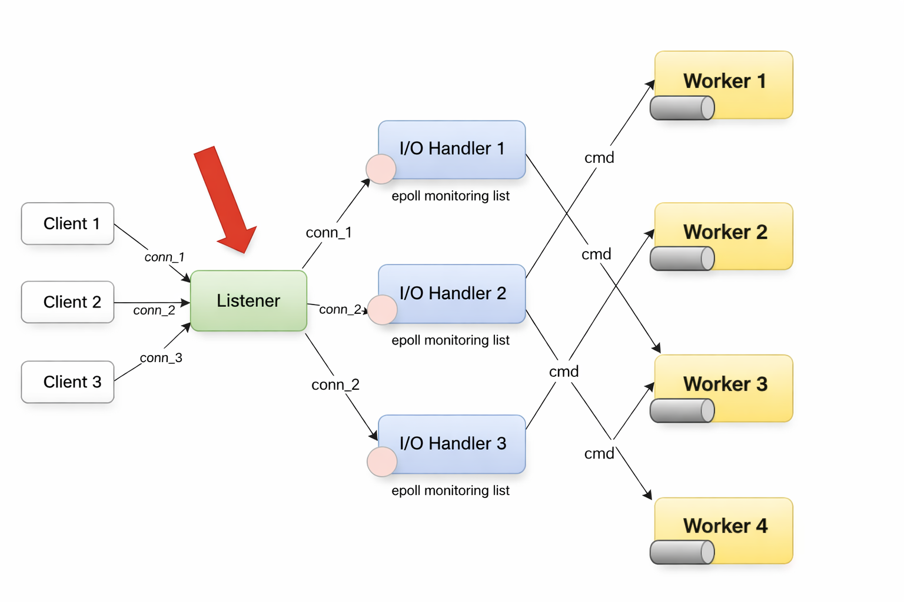
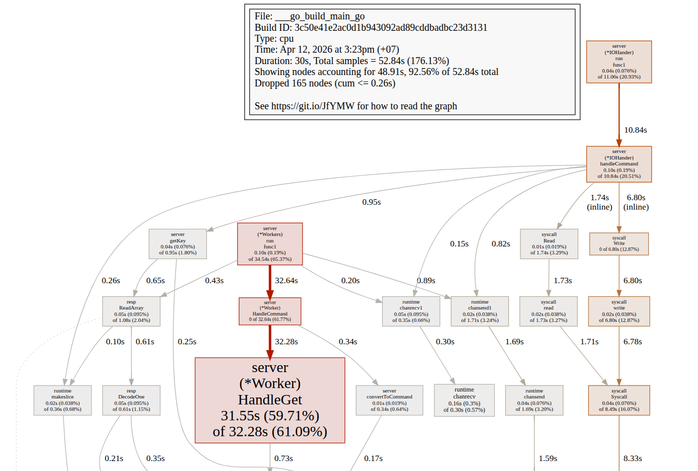

# A high performance Redis in Go


## 🏗️ Architecture



Detailed explanation with diagrams is available in [architecture.md](architecture.md).

## ⚙️ Features

- **Redis Serialization Protocol**

- **Data Structures**
    - Hash dictionary
    - SkipList (for sorted sets)
    - Bloom Filter
    - Count-Min Sketch
    - Eviction Pool

- **Concurrency Models**
    - Thread-pool
    - Single-threaded + Epoll-based IO multiplexing 
    - Epoll-based IO multiplexing with shared nothing architecture

- **Graceful Shutdown**  
  - With resource cleanup.

- **Benchmarking & Profiling**
    - CPU-bound vs IO-bound workloads
    - Multi-thread vs single-thread performance
    - Visualizations with `pprof`


## 📌 Supported Commands

| Data Structure            | Commands |
|---------------------------|----------|
| **Key-Value Store**       | `PING`, `GET`, `SET`, `TTL`, `EXPIRE`, `DEL`, `EXISTS`, `FLUSHDB`, `PERSIST` |
| **Set**                   | `SADD`, `SISMEMBER`, `SREM`, `SMEMBERS` |
| **Sorted Set (SkipList)** | `ZADD`, `ZSCORE`, `ZRANK` |
| **Count-Min Sketch (CMS)**| `CMS.INITBYPROB`, `CMS.INCRBY`, `CMS.QUERY` |
| **Bloom Filter (BF)**     | `BF.RESERVE`, `BF.MADD`, `BF.MEXISTS` |

## 📊 Benchmarks with 1M request

**Highlights:**
- **Single-thread**: Efficient for IO-bound lightweight workloads.
- **Multi-thread architecture**: Efficient for CPU-bound task.
- **Bloom Filter & CMS**: Sub-linear memory usage with probabilistic guarantees.



Full benchmark results and profiling visualizations are in [benchmark.md](benchmark.md).

## ▶️ Quick Start within 10s

```bash
git clone https://github.com/manh119/Redis.git
cd Redis
go run cmd/main.go

# Connect to server using Redis CLI
redis-cli -p 4000
```

## 🚀 Future Enhancements
- [ ] Persistent storage
- [ ] Pub/Sub messaging
- [ ] Replication
- [ ] Cluster support

---


## 💬✨  Support & Feedback

- [Star repo](https://github.com/manh119/Redis/stargazers) if you find it usefully
   


