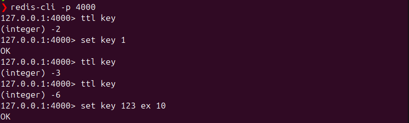

## Architecture

### Thread-Per-Connection Model

### Thread-Pool Model

### Multiplexing model

### Multi-thread with shared nothing architecture

### Basic function with redis-cli

### Skip list for sorted set

### Count min sketch for 100M element ~ 8MB
