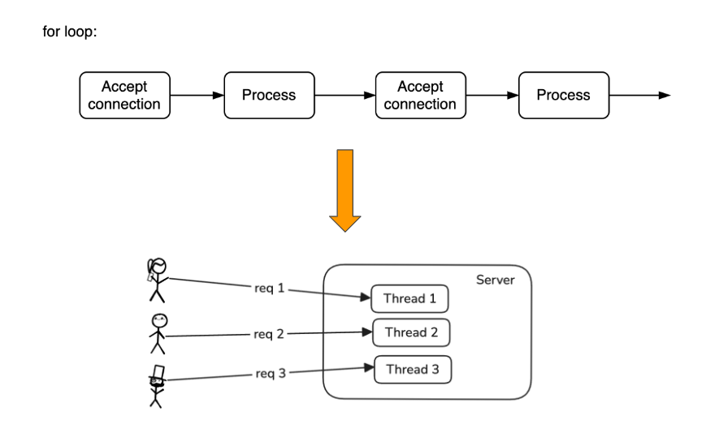
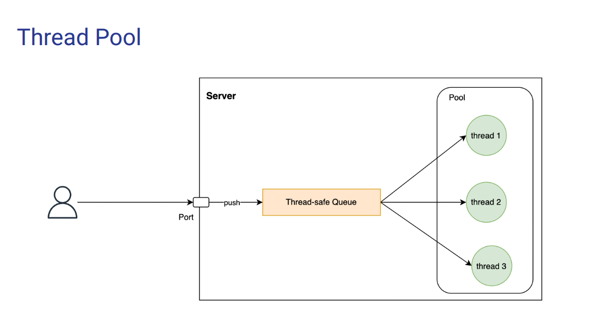
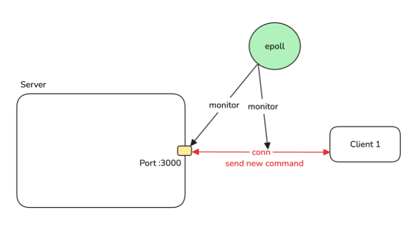
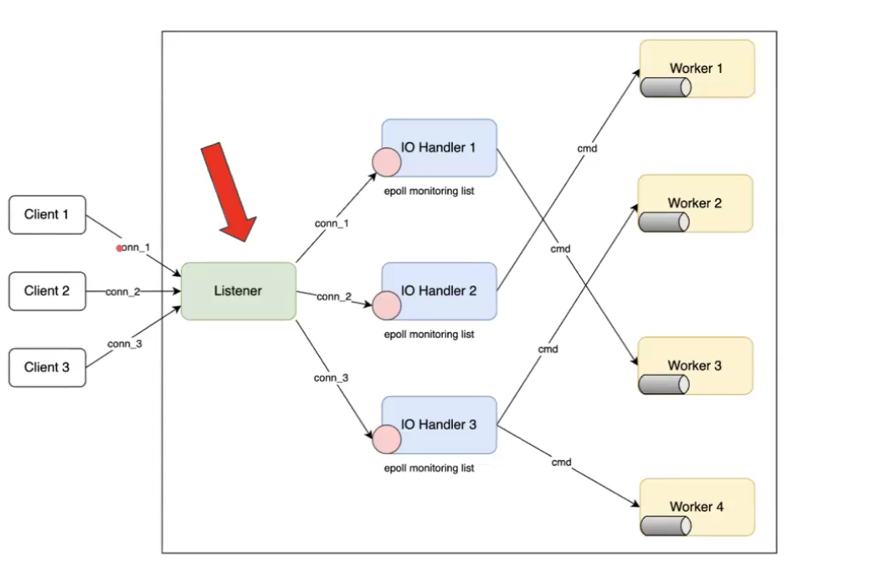
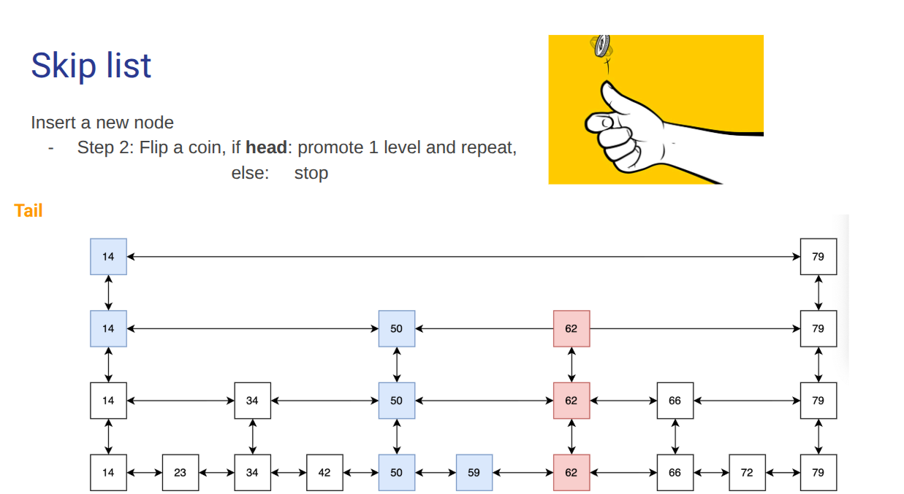
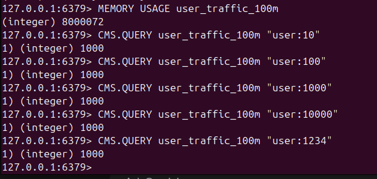

# Architecture

---

## Thread-Per-Connection Model

- each request have a thread to handle
---
## Thread-Pool Model

- pool of fix-size thread, no need to create/destroy each time need or no need in thread per connection model
---
## Multiplexing model

- epoll to monitor tcp listener (for new connection) and connection (for new command)
- event loop 
---
## Multi-thread with shared nothing architecture

- each worker run in a go routine and own its dictionary (hashmap)
- IO handler forward to correct worker by workerId = hash(key)
---
## Skip list for sorted set

- improve search in linked list O(n) -> O(logn) by skip node
---
## Count min sketch for 100M element ~ 8MB

- Trade off beetween Accuracy - Size memory 