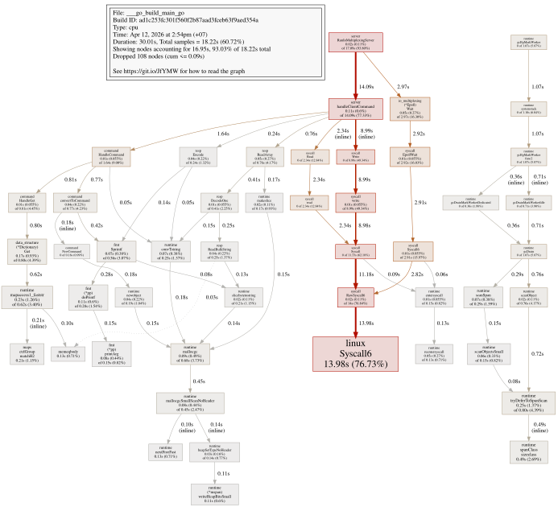
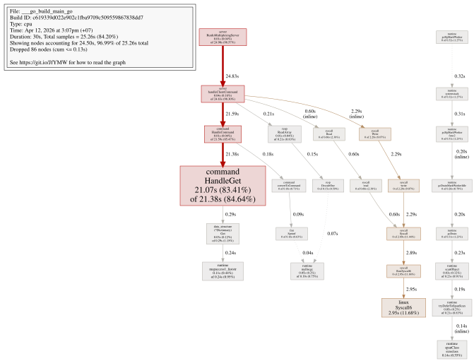
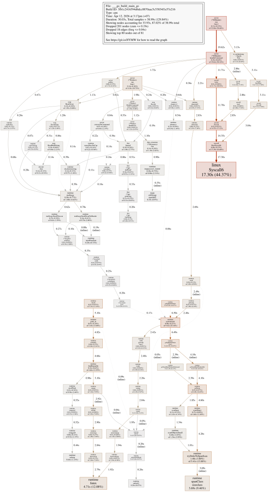
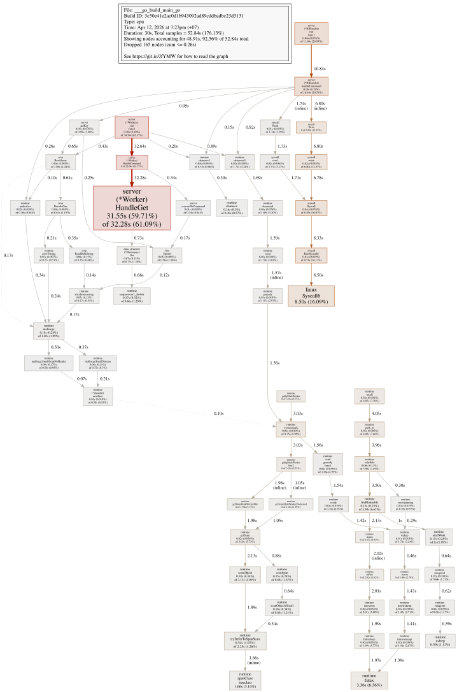

## 📊 Performance Benchmarks (1,000,000 Requests)

---

### 🖥️ Benchmark Environment (My laptop)

- **CPU**: Intel(R) Core(TM) i5-6300U @ 2.40GHz
    - 2 cores 
    - Base frequency: 2.40 GHz, Max Turbo: 3.0 GHz

- **Memory**: 16 GB DDR4
- **Storage**: SSD (system drive)
- **OS**: Ubuntu 24.04 LTS (Linux kernel 6.17.0-20-generic)
- **Go Version**: go1.22.2 linux/amd64
- **Benchmark Tool**: `redis-benchmark`
    - 1,000,000 requests
    - 50 parallel clients
    - 3-byte payloads

---

### 🧩 Scenario 1: Single-threaded (I/O Bound)


| Command | Throughput (RPS) | Avg Latency | P50 | P95 | P99 | Max |
|:--------|:----------------:|:------------:|:----:|:----:|:----:|:----:|
| **SET** | 48,248.58 | 0.556 ms | 0.463 | 0.823 | 1.615 | 16.591 |
| **GET** | 47,337.28 | 0.548 ms | 0.479 | 0.743 | 1.167 | 7.207 |

**Insights:**
- Sub-millisecond average latency.
- Stable tail latency (P99 < 2ms).
- Ideal for lightweight (76.73% is IO operation), high-frequency key-value operations.

  
[View SVG](image/pprof_single_thread_io_bound.svg)
---

### 🧠 Scenario 2: Single-threaded (CPU Bound)
*Simulates heavy computation per request in GET command.*
```bash
func (w *Worker) cmdGET(key string) {
    count := 0
    for i := 0; i < 1000000; i++ {
      count += i
    }
    ...
}
```

| Command | Throughput (RPS) | Avg Latency | P50 | P95 | P99 | Max |
|:--------|:----------------:|:------------:|:----:|:----:|:----:|:----:|
| **SET** | 48,914.11 | 0.546 ms | 0.471 | 0.791 | 1.495 | 21.887 |
| **GET** | 9,778.99 | 5.098 ms | 4.967 | 7.351 | 10.631 | 49.439 |

**Insights:**
- CPU-bound (83.41% is commandGET func) workloads show clear throughput degradation (48k rps -> 9k rps).
- Demonstrates the impact of computation-heavy tasks on latency.

  
[View interactive SVG](image/pprof_single_thread_cpu_bound.svg)

---

### ⚙️ Scenario 3: Multi-threaded I/O Bound (3 workers, 2 I/O handlers)
| Command | Throughput (RPS) | Avg Latency | P50 | P95 | P99 | Max |
|:--------|:----------------:|:------------:|:----:|:----:|:----:|:----:|
| **SET** | 40,561.37 | 0.728 ms | 0.615 | 1.167 | 3.295 | 36.671 |
| **GET** | 39,996.80 | 0.729 ms | 0.615 | 1.111 | 3.415 | 37.983 |

**Insights:**
- Slightly higher latency single thread due to switch context (12.08%) + garbage collector (13%).
- Not better (rqs) than single thread model although having more workers in IO bound task 

  
[View SVG](image/pprof_multi_thread_io_bound.svg)


---

### 🔩 Scenario 4: Multi-threaded (CPU Bound)
*Simulates heavy computation per request in GET command.*
```bash
func (w *Worker) cmdGET(key string) {
    count := 0
    for i := 0; i < 1000000; i++ {
      count += i
    }
    ...
}
```
| Command | Throughput (RPS) | Avg Latency | P50 | P95 | P99 | Max |
|:--------|:----------------:|:------------:|:----:|:----:|:----:|:----:|
| **SET** | 38,317.11 | 0.815 ms | 0.631 | 1.847 | 4.063 | 35.135 |
| **GET** | 17,869.27 | 2.775 ms | 2.519 | 4.895 | 6.831 | 111.551 |

**Insights:**
- Throughput of multi-thread is better (17k rps vs 9k rqs) than single thread in CPU bound task (83% is cmdGET)

  
[View SVG](image/pprof_multi_thread_cpu_bound.svg)
---

### 🧪 Benchmark Commands
```bash
go run cmd/main.go

redis-benchmark -p 4000 -t set -n 1000000 -r 1000000

redis-benchmark -p 4000 -t get -n 1000000 -r 1000000

go tool pprof http://localhost:6060/debug/pprof/profile?seconds=30
