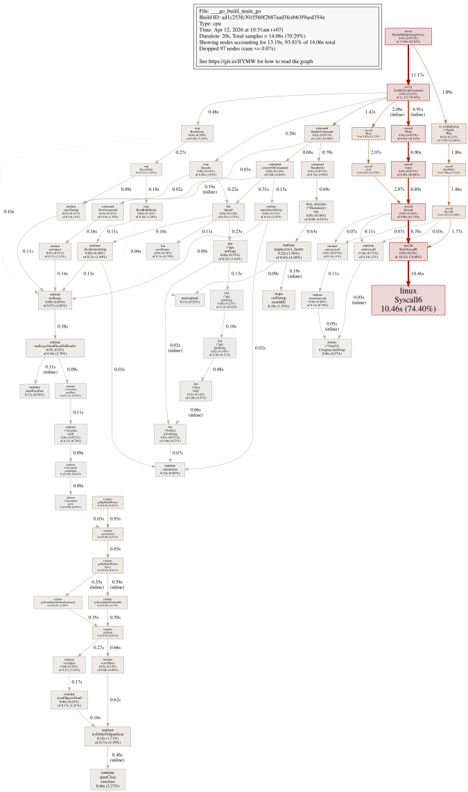

### 🚀 Performance Benchmark (1M Requests)

Our custom Redis implementation was tested using `redis-benchmark` to evaluate its performance under high-concurrency GET operations.

**Results:**
- **Throughput:** 34,164.67 requests per second
- **P99 Latency:** 2.751 ms (High consistency under load)

| Metric (ms) | Avg | P50 | P95 | P99 | Max |
| :--- | :--- | :--- | :--- | :--- | :--- |
| **Latency** | 0.779 | 0.671 | 1.127 | 2.751 | 25.807 |

### 🔍 Deep Dive: CPU Profiling
To understand the performance bottlenecks, I used `pprof` to generate a Flame Graph during the benchmark.

*Figure 1: Flame graph showing hotspots during the GET benchmark.*

**Analysis:**
The profile reveals that the application is **I/O bound**, with nearly **50% of CPU time** spent on Linux System Calls for networking. This confirms the internal logic (parsing and data retrieval) is highly optimized, leaving the kernel's network stack as the primary bottleneck.

❯ redis-benchmark -p 4000 -t set -n 1000000 -r 1000000
WARNING: Could not fetch server CONFIG
====== SET ======                                                   
1000000 requests completed in 29.27 seconds
50 parallel clients
3 bytes payload
keep alive: 1
multi-thread: no

Latency by percentile distribution:
0.000% <= 0.183 milliseconds (cumulative count 1)
50.000% <= 0.671 milliseconds (cumulative count 511452)
75.000% <= 0.863 milliseconds (cumulative count 756330)
87.500% <= 0.951 milliseconds (cumulative count 880330)
93.750% <= 1.079 milliseconds (cumulative count 938872)
96.875% <= 1.295 milliseconds (cumulative count 968751)
98.438% <= 2.103 milliseconds (cumulative count 984420)
99.219% <= 3.103 milliseconds (cumulative count 992212)
99.609% <= 4.079 milliseconds (cumulative count 996107)
99.805% <= 4.823 milliseconds (cumulative count 998051)
99.902% <= 5.639 milliseconds (cumulative count 999026)
99.951% <= 6.847 milliseconds (cumulative count 999513)
99.976% <= 7.839 milliseconds (cumulative count 999756)
99.988% <= 9.375 milliseconds (cumulative count 999878)
99.994% <= 10.567 milliseconds (cumulative count 999939)
99.997% <= 24.623 milliseconds (cumulative count 999970)
99.998% <= 24.735 milliseconds (cumulative count 999985)
99.999% <= 24.815 milliseconds (cumulative count 999995)
100.000% <= 24.831 milliseconds (cumulative count 999998)
100.000% <= 24.847 milliseconds (cumulative count 999999)
100.000% <= 25.807 milliseconds (cumulative count 1000000)
100.000% <= 25.807 milliseconds (cumulative count 1000000)

Cumulative distribution of latencies:
0.000% <= 0.103 milliseconds (cumulative count 0)
0.000% <= 0.207 milliseconds (cumulative count 2)
0.001% <= 0.303 milliseconds (cumulative count 11)
0.009% <= 0.407 milliseconds (cumulative count 85)
0.085% <= 0.503 milliseconds (cumulative count 852)
34.029% <= 0.607 milliseconds (cumulative count 340294)
55.525% <= 0.703 milliseconds (cumulative count 555251)
65.760% <= 0.807 milliseconds (cumulative count 657596)
82.619% <= 0.903 milliseconds (cumulative count 826188)
91.401% <= 1.007 milliseconds (cumulative count 914008)
94.510% <= 1.103 milliseconds (cumulative count 945097)
96.187% <= 1.207 milliseconds (cumulative count 961872)
96.921% <= 1.303 milliseconds (cumulative count 969208)
97.374% <= 1.407 milliseconds (cumulative count 973740)
97.656% <= 1.503 milliseconds (cumulative count 976561)
97.858% <= 1.607 milliseconds (cumulative count 978584)
97.983% <= 1.703 milliseconds (cumulative count 979828)
98.111% <= 1.807 milliseconds (cumulative count 981107)
98.215% <= 1.903 milliseconds (cumulative count 982152)
98.331% <= 2.007 milliseconds (cumulative count 983307)
98.442% <= 2.103 milliseconds (cumulative count 984420)
99.221% <= 3.103 milliseconds (cumulative count 992212)
99.623% <= 4.103 milliseconds (cumulative count 996227)
99.844% <= 5.103 milliseconds (cumulative count 998439)
99.923% <= 6.103 milliseconds (cumulative count 999226)
99.962% <= 7.103 milliseconds (cumulative count 999621)
99.978% <= 8.103 milliseconds (cumulative count 999783)
99.986% <= 9.103 milliseconds (cumulative count 999862)
99.992% <= 10.103 milliseconds (cumulative count 999923)
99.995% <= 11.103 milliseconds (cumulative count 999950)
100.000% <= 25.103 milliseconds (cumulative count 999999)
100.000% <= 26.111 milliseconds (cumulative count 1000000)

Summary:
throughput summary: 34164.67 requests per second
latency summary (msec):
avg       min       p50       p95       p99       max
0.779     0.176     0.671     1.127     2.751    25.807

❯ redis-benchmark -p 4000 -t get -n 1000000 -r 1000000
WARNING: Could not fetch server CONFIG
====== GET ======                                                   
1000000 requests completed in 28.65 seconds
50 parallel clients
3 bytes payload
keep alive: 1
multi-thread: no

Latency by percentile distribution:
0.000% <= 0.223 milliseconds (cumulative count 2)
50.000% <= 0.671 milliseconds (cumulative count 507483)
75.000% <= 0.855 milliseconds (cumulative count 764481)
87.500% <= 0.919 milliseconds (cumulative count 877679)
93.750% <= 0.991 milliseconds (cumulative count 938281)
96.875% <= 1.143 milliseconds (cumulative count 969379)
98.438% <= 1.399 milliseconds (cumulative count 984375)
99.219% <= 1.999 milliseconds (cumulative count 992192)
99.609% <= 2.783 milliseconds (cumulative count 996099)
99.805% <= 3.847 milliseconds (cumulative count 998050)
99.902% <= 4.823 milliseconds (cumulative count 999025)
99.951% <= 5.631 milliseconds (cumulative count 999513)
99.976% <= 6.479 milliseconds (cumulative count 999758)
99.988% <= 7.127 milliseconds (cumulative count 999878)
99.994% <= 7.839 milliseconds (cumulative count 999939)
99.997% <= 8.871 milliseconds (cumulative count 999970)
99.998% <= 10.655 milliseconds (cumulative count 999985)
99.999% <= 10.687 milliseconds (cumulative count 999993)
100.000% <= 10.703 milliseconds (cumulative count 999999)
100.000% <= 10.727 milliseconds (cumulative count 1000000)
100.000% <= 10.727 milliseconds (cumulative count 1000000)

Cumulative distribution of latencies:
0.000% <= 0.103 milliseconds (cumulative count 0)
0.001% <= 0.303 milliseconds (cumulative count 9)
0.004% <= 0.407 milliseconds (cumulative count 40)
0.366% <= 0.503 milliseconds (cumulative count 3657)
35.998% <= 0.607 milliseconds (cumulative count 359984)
54.353% <= 0.703 milliseconds (cumulative count 543525)
66.103% <= 0.807 milliseconds (cumulative count 661032)
85.483% <= 0.903 milliseconds (cumulative count 854829)
94.473% <= 1.007 milliseconds (cumulative count 944734)
96.449% <= 1.103 milliseconds (cumulative count 964487)
97.590% <= 1.207 milliseconds (cumulative count 975901)
98.128% <= 1.303 milliseconds (cumulative count 981282)
98.457% <= 1.407 milliseconds (cumulative count 984575)
98.659% <= 1.503 milliseconds (cumulative count 986588)
98.846% <= 1.607 milliseconds (cumulative count 988457)
98.974% <= 1.703 milliseconds (cumulative count 989738)
99.077% <= 1.807 milliseconds (cumulative count 990769)
99.151% <= 1.903 milliseconds (cumulative count 991514)
99.224% <= 2.007 milliseconds (cumulative count 992242)
99.289% <= 2.103 milliseconds (cumulative count 992891)
99.693% <= 3.103 milliseconds (cumulative count 996927)
99.830% <= 4.103 milliseconds (cumulative count 998298)
99.922% <= 5.103 milliseconds (cumulative count 999225)
99.968% <= 6.103 milliseconds (cumulative count 999676)
99.987% <= 7.103 milliseconds (cumulative count 999873)
99.994% <= 8.103 milliseconds (cumulative count 999943)
99.997% <= 9.103 milliseconds (cumulative count 999972)
99.998% <= 10.103 milliseconds (cumulative count 999984)
100.000% <= 11.103 milliseconds (cumulative count 1000000)

Summary:
throughput summary: 34900.36 requests per second
latency summary (msec):
avg       min       p50       p95       p99       max
0.746     0.216     0.671     1.031     1.727    10.727
